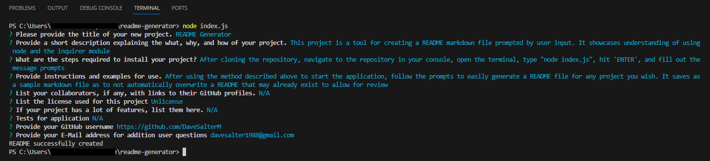

  # README Generator

  

  ## Description

  This project is a tool for creating a README markdown file prompted by user input. It showcases understanding of using node and the inquirer module

  ## Table of Contents

  - [Installation](#installation)
  - [Usage](#usage)
  - [Credits](#credits)
  - [License](#license)

  ## Installation

  After cloning the repository, navigate to the repository in your console, open the terminal, type "node index.js", hit 'ENTER', and fill out the message prompts

  ## Usage

  After using the method described above to start the application, follow the prompts to easily generate a README file for any project you wish. It saves as a sample markdown file as to not automatically overwrite a README that may already exist to allow for review

  
  
  

  ## Credits 

  N/A

  ## License

  Unlicense 

  Click the badge for further information

  

  ## Questions
  
  For any further questions, please contact davesalter1988@gmail.com, and visit https://github.com/DaveSalterM for addition projects
